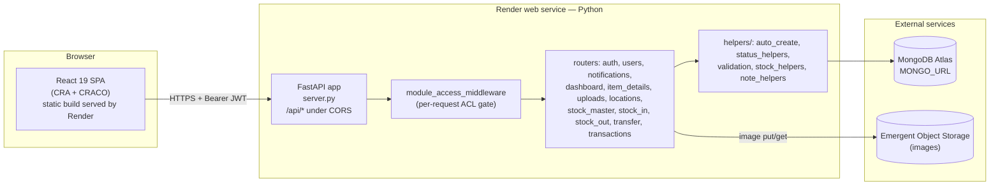
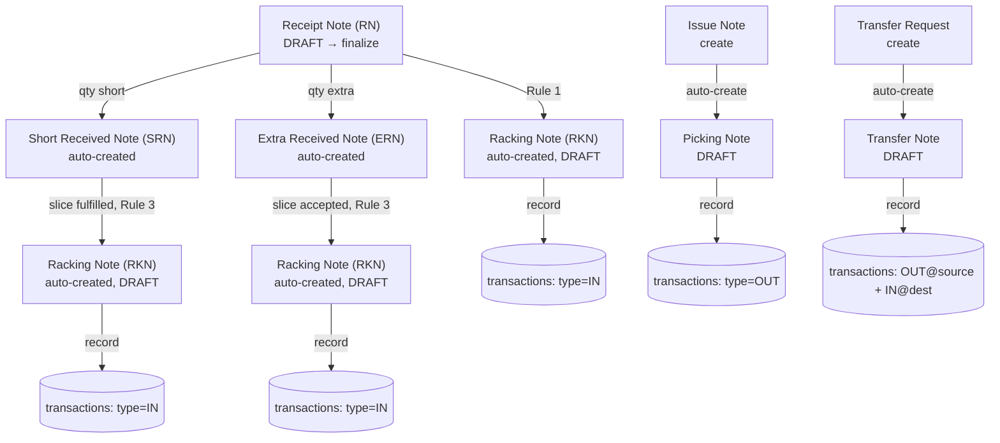

# Architecture

## Overview

A monolithic **FastAPI + Motor (async MongoDB)** backend serving a **React 19 SPA** (Create React App via CRACO), deployed as two independent Render.com services (backend web service + frontend static site) talking over HTTPS/CORS, backed by an external MongoDB (Atlas-style connection string) and an external Emergent object-storage service for images. There is no message queue, no cache layer, no server-side rendering, and no microservices — a single `server.py` process handles every API request.

## Tech stack

| Layer | Technology |
|---|---|
| Backend framework | FastAPI 0.110 (Python 3.11), Uvicorn ASGI server |
| Database driver | Motor 3.3 (async MongoDB), PyMongo 4.5 |
| Auth | PyJWT (HS256), bcrypt password hashing |
| Data validation | Pydantic v2 |
| File/Excel handling | pandas, openpyxl (bulk import/export, CSV/XLSX) |
| Object storage | Emergent Object Storage (external HTTP API), via `boto3`/`s5cmd` present in deps |
| Frontend framework | React 19, React Router 7 |
| Frontend build | Create React App 5 wrapped by CRACO 7 (webpack overrides without ejecting) |
| UI library | Radix UI primitives + shadcn/ui ("new-york" style) + Tailwind CSS |
| HTTP client | Axios |
| Excel export | `xlsx` (SheetJS) |
| Icons | Phosphor Icons (primary), Lucide (shadcn default) |
| Toasts | `sonner` (primary; a legacy shadcn `use-toast` hook also exists, mostly unused) |
| Deployment | Render.com — one Python web service (backend), one static site (frontend); no Docker, no Procfile |
| Scaffolding platform | Emergent (`fastapi_react_mongo_shadcn` cloud template) — see [CODEBASE_NOTES.md](CODEBASE_NOTES.md) |

## Request flow (high level)

1. Browser sends an HTTPS request with `Authorization: Bearer <jwt>` to `REACT_APP_BACKEND_URL/api/...`.
2. CORS middleware checks `Origin` against `CORS_ORIGINS`.
3. `module_access_middleware` (global, in `server.py`) independently decodes the JWT, looks up the user, and — for paths that map to a module in `PATH_TO_MODULE` — 403s upfront if that module is disabled for the (non-admin) user. See [PERMISSIONS.md](PERMISSIONS.md).
4. The matched route handler runs, typically with `Depends(get_current_user)` (or `require_admin` / `_module_dep(...)`) as a second, per-route auth/ACL check.
5. Route handlers call MongoDB directly via the shared `db` handle (no ORM, no repository abstraction) and call into `helpers/*.py` for cross-cutting logic (status computation, validation, serial allocation, auto-creation).
6. Response is a Pydantic model or raw dict; some endpoints set custom response headers (`X-Total-Count`, `X-Unread-Count`, `X-Auto-RKN-No`) that the frontend reads for pagination/toasts.

Full endpoint-by-endpoint detail: [API_REFERENCE.md](API_REFERENCE.md). Full request-to-DB tracing with concrete examples: [DEPENDENCY_FLOW.md](DEPENDENCY_FLOW.md).

## Core domain: the Stock-In / Stock-Out / Transfer engine

The system's real complexity lives in three workflow engines (`routes/stock_in.py`, `routes/stock_out.py`, `routes/transfer.py`), each following the same shape — a **request/intent document** (DRAFT-first) that auto-spawns a **fulfillment document**, which when explicitly "recorded" writes to the single `transactions` ledger:

See [WORKFLOWS.md](WORKFLOWS.md) for step-by-step actor/trigger/DB-change breakdowns and [BUSINESS_RULES.md](BUSINESS_RULES.md) for the exact status state machines and validation rules.

## Why no repository/service layer?

The backend was built iteratively (originally a single ~6600-line `server.py`, refactored in "Phase 3" into `routes/*.py` — see git history / PRD) directly on top of Motor collections, with business logic extracted into `helpers/*.py` functions rather than a formal service/repository architecture. This is a pragmatic, not accidental, choice for a small-team CRUD-heavy app — documented here so a new developer doesn't go looking for a repository layer that doesn't exist.
