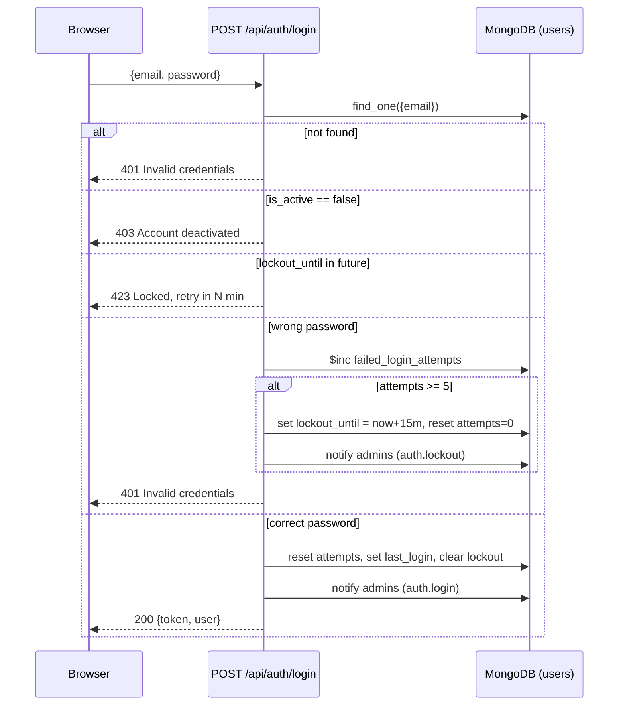

# Authentication

## Summary

Stateless bearer-JWT auth, `HS256`, single 7-day access token issued at login. **No refresh token mechanism exists.** Passwords hashed with bcrypt. 5-strike / 15-minute account lockout. No server-side logout (client discards the token).

## Password hashing

`bcrypt.hashpw(password.encode(), bcrypt.gensalt())` / `bcrypt.checkpw`. `verify_password` swallows any exception (e.g. malformed hash) and returns `False`.

## Login flow — `POST /api/auth/login`

Body: `UserLogin{email, password}` → public (no auth required).

1. Email lowercased, user looked up by email.
2. User not found → `401 "Invalid credentials"` (no user-enumeration signal — same error as a wrong password).
3. `is_active is False` → `403 "Account deactivated. Contact your administrator."`
4. **Lockout check**: if `lockout_until` is set and still in the future → `423 Locked` with a message stating remaining minutes (min 1).
5. **Password check**:
   - Wrong password → increments `failed_login_attempts`. If the count reaches **5**, sets `lockout_until = now + 15 minutes` and resets `failed_login_attempts` to 0 in the same update, and fires an admin notification (`type="auth.lockout"`). Always raises `401 "Invalid credentials"` regardless of whether lockout was just triggered.
   - Correct password → resets `failed_login_attempts=0`, sets `last_login`, clears `lockout_until`, fires `auth.login` admin notification, issues a JWT.
6. Response: `AuthResponse{token, user: {id, email, name, role, is_active, module_access, force_password_reset}}`.

## Token issuance

`create_access_token(user_id, email)` — claims: `sub` (user id), `email`, `exp` (now + **7 days**), `type: "access"`. Secret from `JWT_SECRET` env var, algorithm `HS256`.

## Per-request validation — `get_current_user` dependency

- Uses `HTTPBearer(auto_error=False)`. No credentials → `401 "Not authenticated"`.
- `jwt.decode`. Expired → `401 "Token expired"`. Invalid signature/shape → `401 "Invalid token"`.
- Looks up `db.users` by `id == payload["sub"]` (excludes `_id`/`password_hash` from the returned dict). Not found → `401 "User not found"`.
- Deactivated → `403 "Account deactivated. Contact your administrator."` — **this means deactivating a user immediately kills all of their active sessions**, even though the JWT itself is still cryptographically valid for up to 7 days.
- Returns the raw user dict (no Pydantic response model) as `user=Depends(get_current_user)` in every protected route.
- `require_admin` wraps this and additionally 403s if `role != "admin"`.

## Logout

No `/auth/logout` endpoint. Since tokens are stateless with no blacklist/revocation collection, logout is purely client-side (the frontend clears `localStorage`). A leaked token remains valid until its 7-day expiry or until the user account is deactivated.

## Other auth endpoints

- `GET /api/auth/me` — any authenticated user, returns their own profile.
- `PUT /api/auth/me` — `ProfileUpdate{name?, password?}`. New password must be ≥6 chars (`400` otherwise); setting a password clears `force_password_reset`. `400 "Nothing to update"` if both fields are empty. Cannot change your own role through this endpoint.

## Force-password-reset flow

`user.force_password_reset` (settable by an admin via `PUT /api/users/{id}`) forces the frontend to redirect the user to `/profile?reset=1` on every navigation until they set a new password (see [ROUTES.md](ROUTES.md) → `Protected` guard, and [WORKFLOWS.md](WORKFLOWS.md) → Login).

## Frontend token handling

- **Storage**: `localStorage` keys `token` and `user` (serialized JSON). No cookies.
- **Attachment**: Axios request interceptor (`lib/api.js`) reads `localStorage.token` and sets `Authorization: Bearer <token>` on every request.
- **401 handling**: a response interceptor clears `token`/`user` and hard-redirects to `/login` on any `401` (unless already on `/login`/`/register`). This is independent of the `AuthContext`'s own `refresh()`-triggered logout.
- **Cross-tab logout**: `AuthProvider` listens for the `storage` event — if another tab clears `token`, this tab's in-memory user state is cleared too.
- **Bootstrapping**: on app mount, `AuthProvider` calls `GET /auth/me`; success populates `user`, failure with 401/403 clears the session; network/5xx errors do *not* log the user out (session persists through transient backend issues).

Full authorization/permission model (roles + per-module ACL): see [PERMISSIONS.md](PERMISSIONS.md).

## Security notes (documentation only — no fixes applied)

- No refresh tokens and no revocation list means a stolen bearer token is valid for up to 7 days unless the account is deactivated.
- The image-serving endpoint `GET /api/files/{path}` accepts the JWT as a `?auth=` query-string parameter (in addition to the `Authorization` header) specifically so `` tags can authenticate — this means the token can end up in browser history / server access logs / referrer headers for that route. See [API_REFERENCE.md](API_REFERENCE.md) → uploads.
- The admin account's password is silently reset to `ADMIN_PASSWORD` on every backend restart if it drifts from that env var — intentional for recoverability, but means changing the admin password via the UI without also updating `ADMIN_PASSWORD` will be undone on the next deploy/restart.
- `module_access_middleware` performs its own independent JWT decode (separate code path from `get_current_user`) — see [PERMISSIONS.md](PERMISSIONS.md) for the two-mechanism ACL design and its implications.
