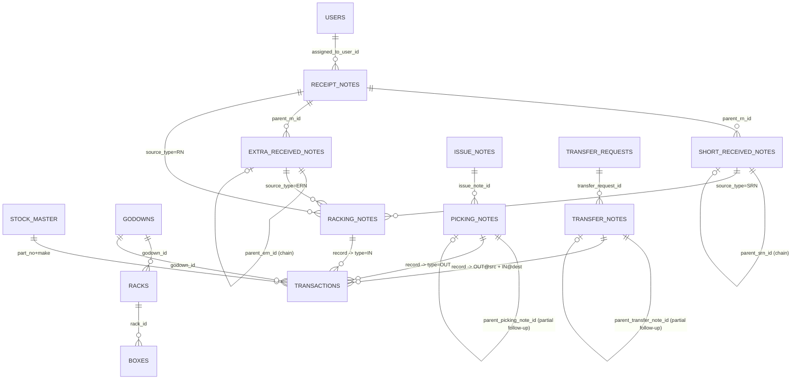

# Database

MongoDB (via Motor async driver), database name from `DB_NAME` env var (default `stock_management`). No ORM — collections are accessed directly as dicts. All "current stock" values are **computed on read** from the `transactions` ledger; no collection stores a mutable running quantity.

## Collection inventory

| Collection | Purpose |
|---|---|
| `users` | Accounts: auth, role, per-module ACL, lockout state. |
| `stock_master` | Item catalog, unique on `(part_no, make)`. |
| `godowns` | Top-level storage locations. |
| `racks` | Racks within a godown. |
| `boxes` | Boxes within a rack. |
| `transactions` | **The stock ledger** — immutable `IN`/`OUT` entries. Sole source of truth for stock levels. |
| `receipt_notes` | Stock-in receipt notes (RN). |
| `short_received_notes` | SRN — shortfall tracking with chained slice/child fulfillment. |
| `extra_received_notes` | ERN — surplus tracking with chained slice/child accept/reject. |
| `racking_notes` | Physical put-away (RKN), polymorphic source (RN/SRN/ERN). |
| `issue_notes` | Stock-out issue requests. |
| `picking_notes` | Physical picking execution against an issue note. |
| `transfer_requests` | Requests to move stock between locations. |
| `transfer_notes` | Physical execution of a transfer (source + destination locations). |
| `counters` | Serial-number allocation, one doc per `"{series}:{fy}"` (e.g. `"rn:26-27"`), `{_id, value}`. |
| `column_settings` | Admin-configurable table column layout per page, unique on `page`. |
| `notifications` | In-app notification feed. |
| `uploads` | Tracking table for object-storage files (gatekeeper for authenticated serving). |
| `stock_balance` | Read-only in `item_details.py`; per-location balance snapshot — not written to by any of the reviewed backend-core files, likely maintained by the stock-in/out/transfer route modules. Treat as a secondary/derived view, not authoritative (the `transactions` ledger is authoritative). |
| `stock_out_locks` | Transient per-location distributed lock docs (`_id = part\|\|make\|\|godown\|\|rack\|\|box`) used only during Picking Note recording to prevent double-spend; not a persistent business record. |
| `inventory_audit_logs` | Before/after audit trail — **only written by `transfer.py`** (Transfer Request/Note create/edit/record). Not used by the RN/SRN/ERN/RKN/Issue/Picking flows. |

## Entity relationship diagram

## Model reference

All models defined in `backend/models.py` (Pydantic v2, `StockMasterBase` uses `extra="ignore"`). "Required" below means required in the create/update payload model, not necessarily non-nullable in the DB (many are defaulted).

### `users`
Not a single formal response model — shaped as raw dicts / `_user_to_public()`. Observed document shape:
`id, email (unique), name, password_hash (bcrypt), role ("admin"|"staff"), is_active (bool), module_access (dict[str,bool]), force_password_reset (bool), failed_login_attempts (int), lockout_until (optional ISO str), last_login (optional), created_at, created_by (optional), deactivated_at (optional)`.

Related payload models: `UserCreate{email, password, name, role="staff", module_access?, force_password_reset=False}`, `UserUpdate` (all-optional partial), `ProfileUpdate{name?, password?}` (self-service, no role field), `UserLogin{email, password}`, `AuthResponse{token, user: dict}`.

### `stock_master`
`StockMasterBase`: `model=""`, `part_no` **(required)**, `old_part_no/new_part_no/make_part_no=""`, `description_1/description_2=""`, `remarks_oem/remarks_others=""` (UI labels "OEM"/"Remarks"; migrated from legacy `oem`/`remarks`), `make` **(required)**, `item_category=""`, `unit=""`, `reorder_level: int=0`, `image=""` (legacy single image), `images: List[str]=[]` (max 5, enforced in route code not the model).
`StockMaster` (response) adds: `id, created_at, in_use: bool=False` (computed on read — true if referenced by any transaction).
Unique index: `(part_no, make)`.

### `godowns` / `racks` / `boxes`
- `Godown{id, godown_name, created_at}` (create: `{godown_name}`).
- `Rack{id, godown_id, rack_no, total_boxes: int=0, created_at}` (create: `{godown_id, rack_no, total_boxes=0}`).
- `Box{id, rack_id, box_no, box_category="", created_at}` (create: `{rack_id, box_no, box_category=""}`).
- Deletes are blocked if the location id appears anywhere in `transactions`.

### `transactions` (the ledger)
No single formal model in the reviewed excerpt; document shape built inline at each write site:
`id, type ("IN"|"OUT"), part_no, make`, denormalized stock-master snapshot (`model, old_part_no, make_part_no, description_1/2, remarks_oem/others, item_category, image`), `quantity, godown_id/name, rack_id/no, box_id/no/category`, linkage fields depending on origin (`racking_note_id/no, source_type/id/no, receipt_note_id/no` for stock-in; `picking_note_id/no, issue_note_id/no, issued_to` for stock-out; `transfer_note_id/no, transfer_request_id/no` for transfers), `created_at, created_by (email)`.
Append-only ledger — no explicit before/after quantity snapshot per row; current balance is always recomputed by aggregation. Legacy simple-movement models `StockInCreate`/`StockOutCreate{part_no, make, quantity, godown_id, rack_id, box_id}` still exist but their direct-creation endpoints are largely disabled (see [WORKFLOWS.md](WORKFLOWS.md)).

### `receipt_notes`
`ReceiptNoteItem{part_no, make, invoice_qty?, received_qty?, description_1="" (denormalized), quantity? (legacy alias)}`.
`ReceiptNoteCreate{stock_in_type="INVOICE"|"GENERAL", invoice_no, invoice_date, goods_received_date, items=[], assigned_to_user_id?, narration=""}`.
`ReceiptNote{id, rn_no, rn_date, fy, serial, stock_in_type="INVOICE", invoice_no="", invoice_date="", goods_received_date="", items, status="DRAFT" (DRAFT→RACKING_NOTE_DRAFT→PARTIALLY_RACKED→FULLY_RACKED), finalized_at, racked_at, created_at, created_by="", assigned_to_user_id/name/email, has_racking_note: bool=False (computed on read), narration}`.

### `short_received_notes`
`ShortReceivedNoteItem{part_no, make, invoice_qty=0, received_qty=0, short_qty (required), fulfilled_qty?, [denormalized master snapshot fields], quantity? (legacy alias), children: [{child_srn_no, received_qty, not_receivable_qty, created_at, status}] = []}`.
`ShortReceivedNote{id, srn_no, srn_date, fy, serial, parent_rn_id, parent_rn_no/date, parent_srn_id/no (chain), chain_remarks, invoice_no/date, fulfillment_date, items, status="PENDING" (PENDING→PARTIALLY_RECEIVED→COMPLETE), finalized_at, created_at, created_by="", assigned_to_user_id/name/email, narration}`.

### `extra_received_notes`
`ExtraReceivedNoteItem{part_no, make, invoice_qty=0, received_qty=0, extra_qty (required), accepted_qty?, rejected_qty?, [denormalized master snapshot fields], quantity? (legacy alias), children: [{child_ern_no, accepted_qty, rejected_qty, created_at, status}] = []}`.
`ExtraReceivedNote{id, ern_no, ern_date, fy, serial, parent_rn_id, parent_rn_no/date, parent_ern_id/no (chain), chain_remarks, invoice_no/date, goods_received_date, items, status="PENDING" (PENDING→PARTIALLY_ACCEPTED→COMPLETE), finalized_at, created_at, created_by="", assigned_to_user_id/name/email, narration}`.

### `racking_notes`
`RackingNoteItem{part_no, make, quantity, [denormalized master fields], godown_id/name, rack_id/no, box_id/no, box_category}`.
`RackingNoteCreate{source_type?("RN"|"SRN"|"ERN"), source_id?, receipt_note_id? (legacy back-compat), items, narration}`.
`RackingNote{id, rkn_no, rkn_date, fy, serial, source_type="RN", source_id="", source_no="", source_date="", receipt_note_id/no/date (legacy, always the ultimate parent RN even when source is SRN/ERN), items, status="DRAFT" (DRAFT→RECORDED), recorded_at, created_at, created_by="", auto_created: bool=False, auto_source? ("rn-finalize"|"rkn-record-balance"|"srn-child-save"|"ern-child-save"), narration}`.

### `issue_notes`
`IssueNoteItem{part_no, make, quantity, selected_godown_id/name? (office preference), [denormalized fields]}`.
`IssueNoteCreate{issued_to="", items, assigned_to_user_id?}`.
`IssueNote{id, in_no, in_date, fy, serial, issued_to="", items, status="PICKING_PENDING" (active set: PICKING_PENDING, PICKING_IN_PROGRESS, PARTIALLY_PICKED, FULLY_PICKED, OPEN-fallback), picked_at, created_at, created_by="", assigned_to_user_id/name/email}`.

### `picking_notes`
`PickingNoteItem{part_no, make, quantity, [denormalized master + full location fields]}`.
`PickingNoteCreate{issue_note_id (required), items}`.
`PickingNote{id, pn_no, pn_date, fy, serial, issue_note_id, issue_note_no/date, parent_picking_note_id? (partial-pick chain), issued_to="", assigned_items: [IssueNoteItem]=[] (frozen snapshot of the request), items (what was actually picked), status="PENDING" (active: PENDING, DRAFT, RECORDING-transient, COMPLETED; legacy RECORDED referenced only in guard clauses, never written), recorded_at, created_at, created_by=""}`.

### `transfer_requests`
`TransferRequestItem{part_no, make, quantity, dest_godown_id/name?, dest_rack_id/no?, dest_box_id/no?, dest_box_category?}`.
`TransferRequestCreate{purpose="", items, assigned_to_user_id?}`.
`TransferRequest{id, str_no, str_date, fy, serial, purpose="", items, status="PENDING" (active: NEW, PENDING, IN_PROGRESS, COMPLETED; CLOSED/CANCELLED documented but no code path sets them), transferred_at, created_at, created_by="", assigned_to_user_id/name/email}`.

### `transfer_notes`
`TransferNoteItem{part_no, make, quantity, [denormalized master fields], src_godown_id (required)/rack_id (required)/box_id/no/category, dest_godown_id (required)/rack_id/box_id/no/category (others optional)}`.
`TransferNoteCreate{transfer_request_id (required), items}`.
`TransferNote{id, stn_no, stn_date, fy, serial, transfer_request_id, transfer_request_no/date, parent_transfer_note_id? (partial-transfer chain), execution_attempt: int=1, assigned_items: [TransferRequestItem]=[], items, status="PENDING" (active: PENDING, DRAFT, PROCESSING-transient, COMPLETED; legacy RECORDED referenced only in guard clauses), recorded_at, created_at, created_by=""}`.

### `counters`
`{_id: "{series}:{fy}", value: int}` — one doc per series×FY. Series values: `rn, rkn, srn, ern, in, pn, str, stn`.

### `column_settings`
`{page (unique), columns: [...]}` — currently only `page="stock_master"` in active use.

### `notifications`
`{id, created_at, actor_id/name/email, type (e.g. "auth.login", "stock_master.created", "receipt_note.created"), module?, title, message, ref_collection, ref_id, audience ("admin"|"module"|"user"), target_user_id? (when audience="user"), read_by: [user_id], dismissed_by: [user_id]}`.

### `uploads`
`{id, storage_path, content_type, size, uploaded_by (user id), uploaded_by_email, is_deleted: bool=False, created_at}` — gatekeeper table; `GET /api/files/{path}` only serves paths tracked here with `is_deleted=False`.

### `inventory_audit_logs`
`{id, module="stock_transfer", action (free string, e.g. "request.created", "transfer_note.completed"), ref_collection, ref_id, old_value, new_value, created_at, created_by}`.

## Denormalization pattern

Nearly every "note" item embeds a snapshot of relevant `stock_master` fields (`model, description_1/2, remarks_oem/others, item_category, unit`, etc.) at the time the row was written, rather than joining live. This trades write-time duplication for read-speed and historical accuracy (a note shows what the item looked like *then*, even if `stock_master` is edited later). `dashboard.py`'s stock-balance/low-stock endpoints are the exception — they join `stock_master`/`godowns`/`racks`/`boxes` live on every request rather than trusting any cached snapshot.

## Indexing summary

Every "note" collection gets: unique `id`, unique `(fy, serial)`, index on `created_at`, index on `status`, and a parent-reference index (`racking_notes.(source_type, source_id)`, `picking_notes.issue_note_id`, `transfer_notes.transfer_request_id`, `short_received_notes.parent_rn_id`, `extra_received_notes.parent_rn_id`). `stock_master` additionally indexes `make, model, description_1, description_2, item_category, unit, reorder_level, created_at` individually to support the Excel-style column filter UI. `users.email` and `stock_master.(part_no, make)` are the two business-uniqueness constraints enforced at the DB level.
