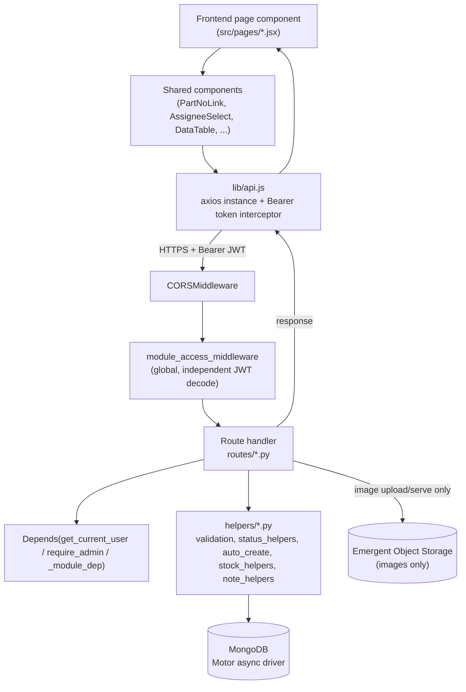

# Dependency / Request Flow

There is no formal service/repository layering in this codebase (see [ARCHITECTURE.md](ARCHITECTURE.md) for why) — a request travels: **Frontend page → Axios client → FastAPI route handler → helper functions → MongoDB**, with no intermediate abstraction layers to trace through.

## Worked example: recording a Racking Note (the stock-in moment)

1. **Frontend** — `RackingNoteTab.jsx` (rendered inside `StockInPage.jsx`, route `/stock-in`) calls `api.post('/racking-notes/{id}/record')` via the shared Axios instance, which has already attached `Authorization: Bearer <token>`.
2. **CORS** — `CORSMiddleware` checks the request `Origin` against `CORS_ORIGINS`.
3. **Global ACL middleware** — `module_access_middleware` matches `/api/racking-notes/...` → module key `stock_in`; independently decodes the JWT and 403s upfront if the user's `module_access.stock_in` is explicitly `false`.
4. **Route dependency** — the handler in `routes/stock_in.py` also carries `Depends(get_current_user)` (and, per the file's usage pattern, likely `Depends(_module_dep("stock_in"))` on write-heavy endpoints) — a second, independent auth/ACL check.
5. **Route handler** (`record_racking_note`) — re-validates every row has godown/rack/box/quantity, calls `_validate_cumulative_qty_polymorphic` (`helpers/validation.py`) to ensure the total doesn't exceed the source's rackable quantity.
6. **Write** — builds one `IN` transaction document per line and `insert_many`s directly into `db.transactions` (Motor, no intermediate DAO class).
7. **Status bubble-up** — calls `_recompute_source_status_after_rkn` (`helpers/status_helpers.py`), which re-reads the RN/SRN/ERN's full source graph and updates its `status` field.
8. **Auto-creation** — calls `_auto_create_rkn_for_source` (`helpers/auto_create.py`, Rule 2) if pending quantity remains on the source.
9. **Notification** — `_notify(...)` (`deps.py`) inserts a `notifications` document (best-effort, never raises).
10. **Response** — the updated RKN dict (plus header `X-Auto-RKN-No` if Rule 2 fired) flows back through Axios to the React component, which shows a toast (`sonner`) and refreshes its table.

## Worked example: image upload

`StockMasterImageUploader.jsx` → `POST /uploads/image` (multipart) → `routes/uploads.py` validates content-type/size → `storage.py.put_object()` (HTTP PUT to Emergent's external object-storage API) → on success, inserts a tracking doc into `db.uploads` → returns `{path}` → frontend appends `path` into the Stock Master item's `images[]` on the next `PUT /stock-master/{id}` call. Later reads go through `AuthImage.jsx` → `GET /files/{path}` → inline JWT check → `db.uploads` lookup (gatekeeper) → `storage.py.get_object()` → raw bytes streamed back.

## Where the layering breaks the "clean architecture" pattern (intentionally)

- **No repository interfaces** — routes call `db.<collection>.find_one(...)` etc. directly.
- **No DTO/mapper layer** — Pydantic models double as both request validation and (for some, not all) response shaping; many GET-listing endpoints return raw dicts with no `response_model` at all (`dashboard.py`, `item_details.py`, `notifications.py`, `users.py`) — their actual response shape must be read from the handler code, not inferred from FastAPI's auto-generated `/docs`.
- **Business logic lives in route handlers**, not a service layer — `helpers/*.py` factors out the *reusable* pieces (status computation, validation, serial allocation), but the orchestration (what to call, in what order, with what rollback) stays inline in each route function.

This is a deliberate, pragmatic choice for the app's size — see [ARCHITECTURE.md](ARCHITECTURE.md) for the framing, and don't attempt to "restore" a missing service layer as if it were an oversight.
