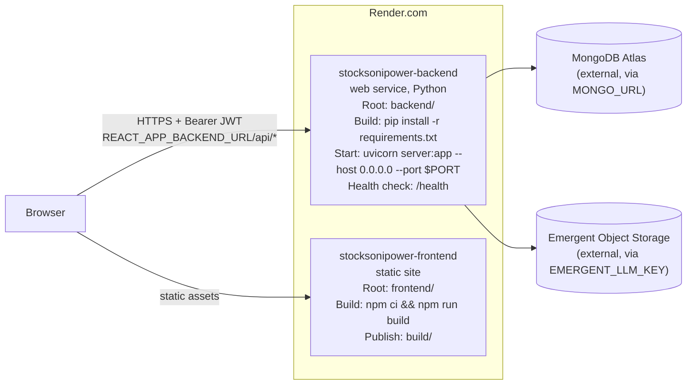

# Deployment

## Topology

Defined entirely in `render.yaml` — a two-service **Render.com** blueprint. No Docker, no Procfile anywhere in the repo (a `procfile.py` match under `backend/.venv/.../pygments/lexers/` is a syntax-highlighting lexer, not a real Procfile).

- **Backend service**: `stocksonipower-backend`, Python runtime, root `backend/`. No `region`/`plan` pinned in `render.yaml` — whatever Render defaults/dashboard settings apply.
- **Frontend service**: `stocksonipower-frontend`, static site, root `frontend/`.
- **No database service** declared in `render.yaml` — MongoDB is entirely external (Atlas), referenced only via `MONGO_URL`.

## Build & start commands

| Service | Build | Start |
|---|---|---|
| Backend | `pip install -r requirements.txt` | `uvicorn server:app --host 0.0.0.0 --port $PORT` |
| Frontend | `npm ci && npm run build` (→ `craco build` under the hood) | Static file serve of `build/`, publish path `build` |

Health check path for the backend service: `/health` (unauthenticated, `{"status":"ok"}`).

## CORS

Not hardcoded — driven entirely by the backend's `CORS_ORIGINS` env var (`sync: false` in `render.yaml`, i.e. set manually per environment in Render's dashboard). Must include the deployed frontend's exact origin. See [ENVIRONMENT_VARIABLES.md](ENVIRONMENT_VARIABLES.md).

## Key backend dependencies (`requirements.txt`)

`fastapi 0.110`, `uvicorn 0.25`, `motor 3.3`/`pymongo 4.5`, `PyJWT 2.12`/`python-jose 3.5`, `passlib`/`bcrypt`, `pydantic 2.12`, `python-dotenv`, `openpyxl`/`pandas` (Excel), `python-multipart` (file upload), `email-validator`, `boto3`/`s3transfer`/`s5cmd` (object-storage tooling). Also present but not exercised by current app scope: `google-generativeai`, `google-genai`, `openai`, `litellm`, `tiktoken` (unused LLM provider SDKs), `stripe` (unused payment SDK). Dev/lint tooling (`black`, `flake8`, `isort`, `mypy`, `pytest`) is also installed in the production build since `requirements.txt` doesn't separate prod/dev deps — a minor deploy-slimming opportunity, not a functional issue.

## Key frontend dependencies (`package.json`)

React 19, `react-router-dom 7`, `axios`, `react-scripts 5` wrapped by `@craco/craco 7`, Radix UI + Tailwind (shadcn "new-york"), `xlsx` (bulk import/export), `sonner` (toasts), `@emergentbase/visual-edits` (dev-only, fetched from `assets.emergent.sh`, disabled in production builds).

## The `.emergent` directory

`.emergent/emergent.yml` shows the project was scaffolded on Emergent's cloud dev platform: `env_image_name: "fastapi_react_mongo_shadcn_base_image_cloud_arm:..."`, confirming the FastAPI+React+MongoDB+shadcn template. `.emergent/summary.txt` is an AI-coding-agent handoff/continuity log, not deployment documentation — see [CODEBASE_NOTES.md](CODEBASE_NOTES.md) for what this implies about the codebase's development history.

## Recent deployment history (from git log)

The commit history shows a cluster of deploy-stabilization commits (`deploy fix`, `deploy fix 2`, `Deployement Fix`, `Frontend fix`, `Frontend fix 3`) leading up to the current `render.yaml`/README setup, plus some git-history-repair commits (`Preserve recovered ... commit ancestry`) suggesting a prior repository repair event. Treat `render.yaml` as the current, working source of truth over any older deployment notes.

## Testing before deploy

`backend/tests/` (~24 pytest files) — run via `pytest` from `backend/`. `test_result.md` documents a structured "main agent ↔ testing agent" protocol used during Emergent-platform development (task entries with `implemented`/`working`/`stuck_count`/`priority` fields) — this is an internal AI-agent workflow artifact, not a CI configuration; there is no GitHub Actions / CI pipeline file in the repo.

See [ENVIRONMENT_VARIABLES.md](ENVIRONMENT_VARIABLES.md) for the full variable list needed to stand up a new environment.
