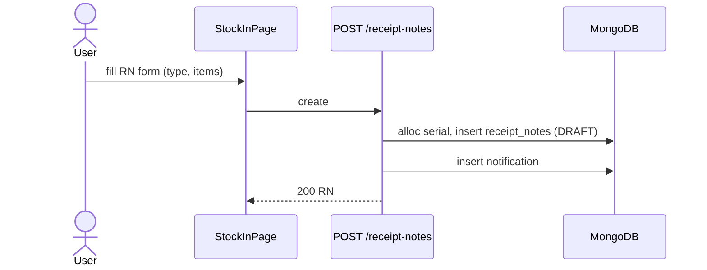
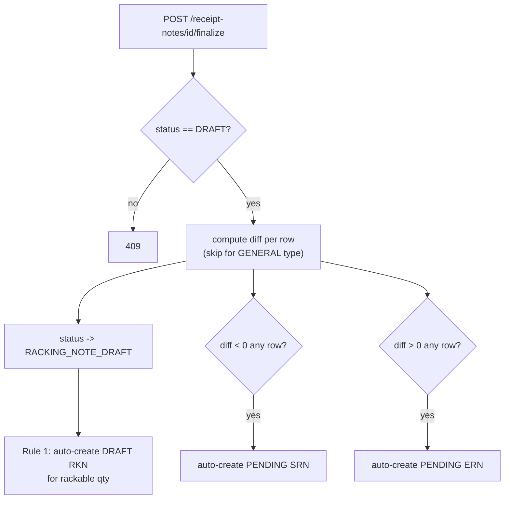
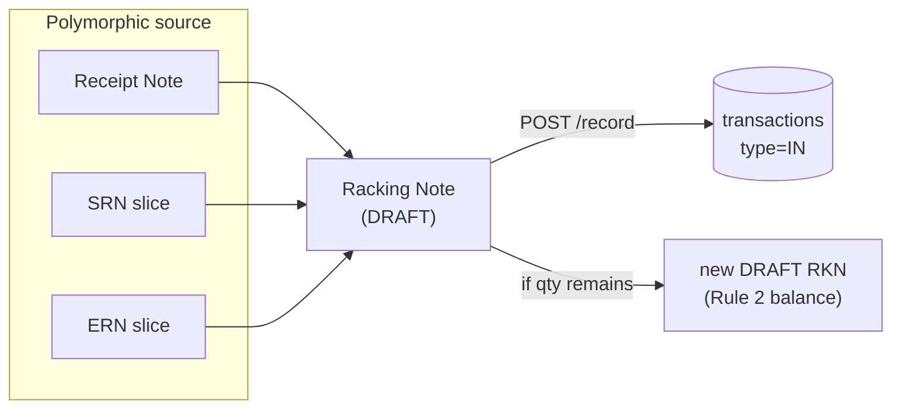
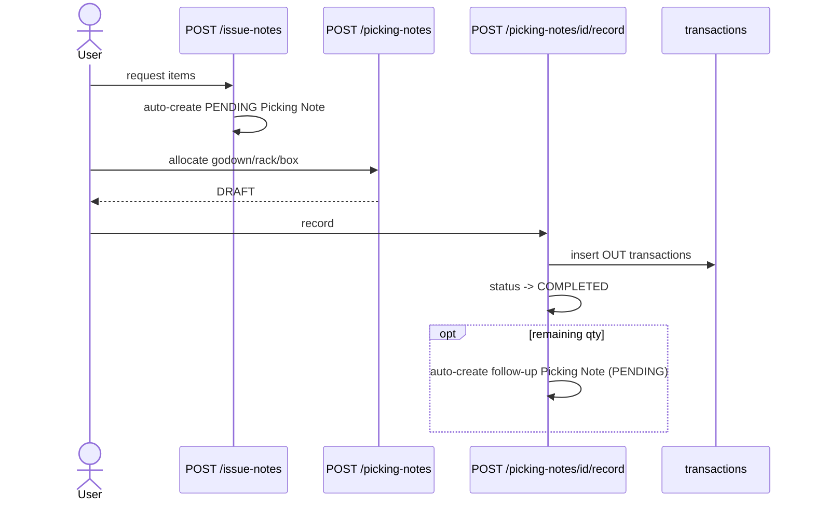

# Workflows

End-to-end walkthroughs of every implemented business workflow. For the underlying status/validation rules referenced here, see [BUSINESS_RULES.md](BUSINESS_RULES.md); for exact request/response shapes, see [API_REFERENCE.md](API_REFERENCE.md).

---
## 1. Login

**Actor**: any user. **Trigger**: submitting the login form on `/login`.

1. Frontend `POST /auth/login {email, password}`.
2. Backend validates existence → active → lockout → password (see [AUTHENTICATION.md](AUTHENTICATION.md) for the full decision tree, including the 5-strike/15-minute lockout).
3. On success: JWT issued, `AuthResponse{token, user}` stored in `localStorage`, `AuthContext.user` set.
4. `Protected` route guard checks `user.force_password_reset` — if true, immediately redirects to `/profile?reset=1` regardless of the originally requested page.
5. Admin notification `auth.login` (or `auth.lockout` on the 5th failure) fired — visible only to admins.

**DB changes**: `users.failed_login_attempts`/`lockout_until`/`last_login` updated; one `notifications` doc inserted.

---
## 2. Create Receipt Note (Stock In entry point)

**Actor**: any user with `stock_in` module access. **Trigger**: "New Receipt Note" on `/stock-in` → Receipt Note tab.

1. User chooses `stock_in_type`: `INVOICE` (has a supplier invoice) or `GENERAL` (no invoice).
2. Per line: part_no + make (autocompleted via `stock-master/lookup/*`, or created inline via `POST /stock-master` if new), and either `invoice_qty` (INVOICE) or `received_qty` (GENERAL, required at creation).
3. `POST /receipt-notes` → `status: DRAFT`, number `RN/{fy}/{serial}` allocated.
4. **Editable at any status** as long as no Racking Note exists against it yet (`409` otherwise). Non-DRAFT edits are assignee-gated.

**DB changes**: one `receipt_notes` doc, `notifications` (`receipt_note.created`, + `receipt_note.assigned` if an assignee was set).

---
## 3. Finalize Receipt Note & receive material

**Actor**: RN owner/assignee or any module user (if unassigned). **Trigger**: "Finalize" on a `DRAFT` RN.

1. User enters/confirms `received_qty` per line (required for GENERAL, may already be entered for INVOICE from step 2 or filled here).
2. `POST /receipt-notes/{id}/finalize` — `409` if not `DRAFT`.
3. Backend computes `diff = received_qty − invoice_qty` per line (GENERAL rows are never diffed — they always net to zero, so **GENERAL receipts never spawn SRN/ERN**).
4. Status → `RACKING_NOTE_DRAFT`, `finalized_at` set.
5. Rows with `diff < 0` → auto-creates one `PENDING` **SRN** for all of them combined.
6. Rows with `diff > 0` → auto-creates one `PENDING` **ERN** for all of them combined.
7. **Rule 1**: auto-creates a `DRAFT` **Racking Note** against the RN for whatever quantity is immediately rackable (i.e. `min(received_qty, invoice_qty)` per line). Response header `X-Auto-RKN-No` triggers a frontend toast.
8. `receipt_note.finalized` notification fired, summarizing what was auto-created.

**Business rule**: this step never moves stock — it only locks in decided quantities and spawns downstream drafts.

---
## 4. Create SRN / fulfill a short-received shortfall

**Actor**: any `stock_in` user. **Trigger**: auto-created by RN finalize (step 3); user then works the SRN over time.

1. SRN starts `PENDING` with `short_qty` per line = `invoice_qty − received_qty`.
2. User adds a **slice** — a fulfillment batch — as stock actually arrives later: `POST /short-received-notes/{id}/children {part_no, make, received_qty, not_receivable_qty}`. Capped at the item's remaining `short_qty`.
3. Each slice with `received_qty > 0` triggers **Rule 3**: auto-creates/extends a `DRAFT` Racking Note against the SRN for that newly-fulfilled amount.
4. Status recomputes automatically: `PENDING` (no activity) → `PARTIALLY_RECEIVED` (some slices decided, not all) → `COMPLETE` (all short qty decided, whether received or marked not-receivable).
5. Editing/deleting a slice is blocked (`409`) if it would reduce received qty below what's already been racked against it.
6. Alternatively, the legacy bulk path (`PUT /short-received-notes/{id}` or `/finalize`) sets `fulfilled_qty` directly; any residual spawns a **child SRN** (a new document, `parent_srn_id` linked) to carry forward the still-undecided remainder.

**Business rule**: `not_receivable_qty` permanently writes off that portion (counts toward `COMPLETE` but never becomes rackable stock).

---
## 5. Create ERN / accept or reject an over-received surplus

**Actor**: any `stock_in` user. **Trigger**: auto-created by RN finalize.

1. ERN starts `PENDING` with `extra_qty` per line = `received_qty − invoice_qty`.
2. User adds a slice: `POST /extra-received-notes/{id}/children {part_no, make, accepted_qty, rejected_qty}`, capped at remaining `extra_qty`.
3. `accepted_qty > 0` triggers **Rule 3 (ERN parallel)**: auto-creates/extends a `DRAFT` Racking Note against the ERN.
4. Alternatively, `POST/PUT /extra-received-notes/{id}/reject` rejects some/all pending extra qty in one shot — **this never creates stock or a Racking Note**, it's a dead end (goods returned to supplier).
5. Status: `PENDING` → `PARTIALLY_ACCEPTED` (any accept/reject decision made, including reject-only — see [BUSINESS_RULES.md](BUSINESS_RULES.md)) → `COMPLETE` (fully decided).
6. Residual on finalize spawns a **child ERN**.

---
## 6. Rack stock (Racking Note record) — the actual stock-in moment

**Actor**: warehouse staff physically placing goods. **Trigger**: a rackable RN/SRN/ERN exists (draft RKN already auto-created, or created manually).

1. `GET /racking-notes/sources` or `/racking-notes/prepare-source` shows what's rackable and prefills locations.
2. User assigns Godown/Rack/Box + quantity per line (`POST`/`PUT /racking-notes`, `status: DRAFT`). Validation caps cumulative racked+pending quantity at the source's rackable total.
3. `POST /racking-notes/{id}/record`:
   - Requires every row to have godown+rack+box+`quantity>0`.
   - Re-validates cumulative quantity.
   - **Inserts one `IN` transaction per line into `transactions`** — this is the only moment stock actually increases anywhere in the system.
   - Status → `RECORDED`, `recorded_at` set.
   - **Rule 2**: if the source still has unracked pending quantity, auto-creates a new `DRAFT` "balance" Racking Note so nothing is silently lost.
   - Idempotent: re-calling `/record` on an already-fully-recorded RKN is a safe no-op (matches existing transactions and just confirms `RECORDED`); a partial/mismatched state raises `409` for manual audit rather than guessing.
4. `_recompute_source_status_after_rkn()` bubbles the new racked quantity up into the RN/SRN/ERN status (see [BUSINESS_RULES.md](BUSINESS_RULES.md)).

---
## 7. Issue stock (Issue Note → Picking Note)

**Actor**: warehouse/office staff. **Trigger**: "New Issue Note" on `/stock-out`.

1. User picks part/make + quantity per line, optionally pinning a `selected_godown_id` (office preference). `_validate_issue_qty_against_stock` rejects requests exceeding live stock (globally, or per-godown if pinned).
2. `POST /issue-notes` → `status: PICKING_PENDING`; **auto-creates a `PENDING` Picking Note** with `assigned_items` frozen as a snapshot of what was requested and `items: []` (no allocation yet). If auto-creation fails, both are rolled back.
3. A picker allocates actual source locations: `POST /picking-notes {issue_note_id, items:[{part_no,make,quantity,godown_id,rack_id,box_id}]}` → `status: DRAFT`. Constrained to not exceed the Issue Note's requested qty per item, and (if pinned) the exact `selected_godown_id`.
4. `POST /picking-notes/{id}/record`:
   - Atomic `DRAFT→RECORDING` lock, per-location distributed lock (`stock_out_locks`), final live-balance recheck.
   - **Writes one `OUT` transaction per line** — the actual stock decrement.
   - `RECORDING→COMPLETED`.
   - **Partial picking**: any qty from the original request not covered by this pick auto-creates a follow-up Picking Note (`parent_picking_note_id`, `PENDING`) so the remainder can be picked later.
   - Full rollback (transactions deleted, follow-up PN deleted, status reset, locks released) on any exception mid-process.
5. Issue Note status recomputes: `PICKING_PENDING` → `PICKING_IN_PROGRESS` (draft allocation exists) → `PARTIALLY_PICKED` → `FULLY_PICKED`.

---
## 8. Transfer stock (Transfer Request → Transfer Note)

**Actor**: any `stock_transfer` user. **Trigger**: "New Transfer Request" on `/stock-transfer`.

1. User requests part/make + quantity (+ optional destination preference). Validated against live total stock.
2. `POST /transfer-requests` → `status: PENDING`; **auto-creates a `PENDING` Transfer Note** immediately (`assigned_items` frozen from the request). Both writes are recorded in `inventory_audit_logs` (`request.created`, `transfer_note.generated`). **There is no approval step** — the request is actionable the moment it's created.
3. User allocates the actual movement: `POST /transfer-notes {transfer_request_id, items:[{...,src_godown_id,src_rack_id,src_box_id,dest_godown_id,...}]}` → `status: DRAFT`. `src_godown_id != dest_godown_id` is enforced (same-godown "transfers" are rejected). Source-location availability is checked net of qty already reserved by other **active** transfer notes, preventing two in-flight transfers from double-booking the same physical stock.
4. `POST /transfer-notes/{id}/record`:
   - Atomic `DRAFT→PROCESSING` lock, final live-balance recheck at the source.
   - **Writes a matched `OUT`@source + `IN`@destination transaction pair per line** — this is how a transfer actually moves stock (a decrement and an increment, same timestamp, linked by `transfer_note_id`).
   - `PROCESSING→COMPLETED`, audit-logged (`transfer_note.completed`).
   - **Partial transfer**: remainder auto-creates a follow-up Transfer Note (`parent_transfer_note_id`, `execution_attempt += 1`).
   - Full rollback on exception.
5. Transfer Request status: `PENDING` → `IN_PROGRESS` (any active note or partial progress) → `COMPLETED` (fully transferred).

---
## 9. Search (Item Details)

**Actor**: any user with `item_details` access (effectively everyone — see [PERMISSIONS.md](PERMISSIONS.md) for why this can't be individually revoked). **Trigger**: typing into the Item Details search box, or clicking any `PartNoLink` elsewhere in the app.

1. Debounced `GET /item-details/search?q=&limit=20` — case-insensitive regex across many `stock_master` fields, returns partial rows for autocomplete.
2. Selecting a result (or a deep link `?part_no=&make=`) calls `GET /item-details?part_no=&make=` — returns the master record, live `stock_balance` rows, `totals`, and the **filtered rows from every note collection** (RN, SRN, ERN, RKN, Issue Note, Picking Note, Transfer Request, Transfer Note) plus the `transactions` ledger for that item — i.e. the complete 360° history of one part/make in one call.

---
## 10. Dashboard

**Actor**: any logged-in user. **Trigger**: navigating to `/` (also auto-refreshes every 60s).

Aggregates: `GET /dashboard/stats` (counts + total stock qty + low-stock count), pending-count widgets for every workflow (`receipt-notes?not_status=FULLY_RACKED`, `racking-notes?status=DRAFT`, `issue-notes?not_status=FULLY_PICKED,COMPLETED`, `picking-notes?status=PENDING,DRAFT`, `transfer-requests?not_status=FULLY_TRANSFERRED`, `transfer-notes?status=DRAFT` — each read via the `X-Total-Count` header, `page_size=1`), and `GET /stock-balance` aggregated client-side into a per-godown summary.

---
## 11. Reports (export)

**Actor**: any user on Stock Master / Locations. **Trigger**: "Export" / "Download Template" buttons.

- `GET /stock-master/download/export[?search=&sort_by=&sort_dir=]` — streaming CSV honoring current filters.
- `GET /stock-master/download/template` — XLSX with sample rows, for bulk-import.
- Equivalent CSV template/bulk-upload/bulk-delete endpoints exist per location level (Godown/Rack/Box) in `routes/locations.py`.
- No PDF or scheduled-report generation exists anywhere in the codebase — "Reports" in this system means CSV/XLSX export of the current filtered view, not a dedicated reporting module.

---
## 12. User Management

**Actor**: admin only. **Trigger**: `/users` page.

1. `GET /users` lists all accounts.
2. `POST /users {email, password, name, role="staff", module_access?, force_password_reset?}` creates an account — role must be `admin`/`staff`, password ≥6 chars, email must be unique.
3. `PUT /users/{id}` edits any field including `module_access` (per-module ACL toggles) and `is_active` (deactivate/reactivate). An admin cannot change their own role away from admin, and cannot deactivate themselves. Reactivating a user also clears any lockout.
4. `DELETE /users/{id}` is a **soft delete** (`is_active: false`, `deactivated_at` set) — historic records referencing this user (as creator or assignee) remain intact; the account simply can no longer log in (enforced at every `get_current_user` call, so it kills active sessions immediately too).

---
## 13. Image Upload (Stock Master)

**Actor**: any user editing a Stock Master item. **Trigger**: adding an image in the item form.

1. `POST /uploads/image` (multipart, ≤10MB, png/jpeg/jpg/gif/webp) → uploaded to Emergent object storage, tracked in `db.uploads`, returns `{path, content_type, size}`.
2. The frontend appends that `path` string into the item's `images[]` array on the subsequent `POST`/`PUT /stock-master` call — **the association between an image and an item happens entirely client-side**; there is no server-side endpoint that links an upload to a specific item at upload time. Max 5 images enforced in the route handler.
3. Images are rendered via `AuthImage.jsx` → `GET /files/{path}` (bearer token in header, or `?auth=` for `` tags) — every image fetch is authenticated and gated by the `uploads` tracking table (`is_deleted: false`).

---
## 14. Notifications

**Actor**: system (auto), consumed by any logged-in user. **Trigger**: any of the many `_notify(...)` call sites across the codebase (login/lockout, user CRUD, stock master create/delete, RN/RKN/Issue/Picking/Transfer key transitions, assignment).

Delivery is **polling only** (30s interval + on window focus) — no WebSocket/SSE. Visibility: admins see everything; non-admins see `audience="user"` notifications targeted at them and `audience="module"` notifications for modules they can access; `audience="admin"` events (login, lockout, user management) are never shown to non-admins. Read/dismiss state is tracked per-user (`read_by`/`dismissed_by` arrays on the shared notification doc, not per-user copies). See [DATABASE.md](DATABASE.md) → `notifications` and [FRONTEND.md](FRONTEND.md) → NotificationBell.
